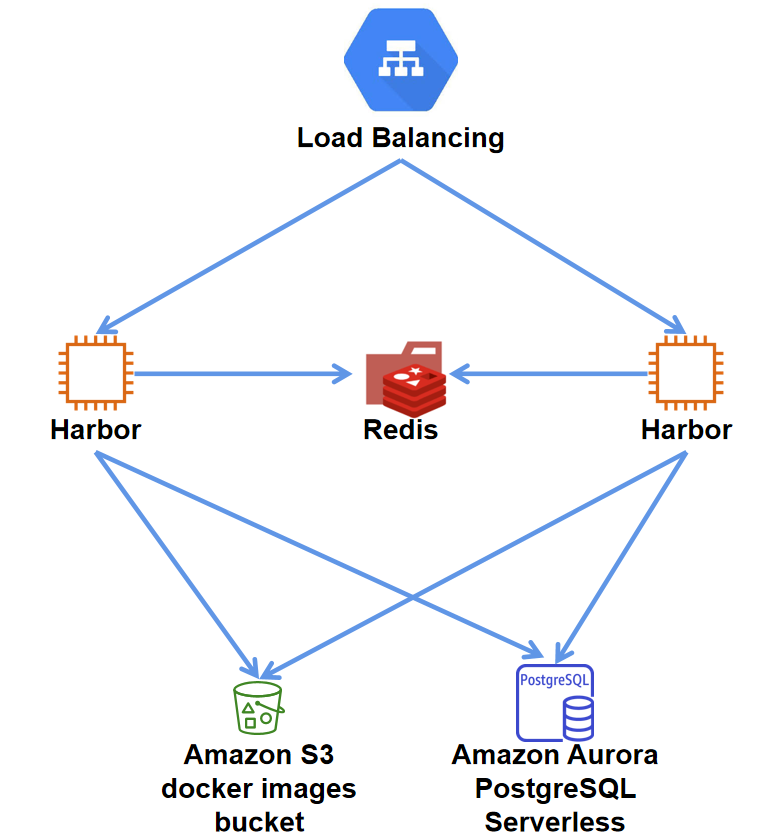
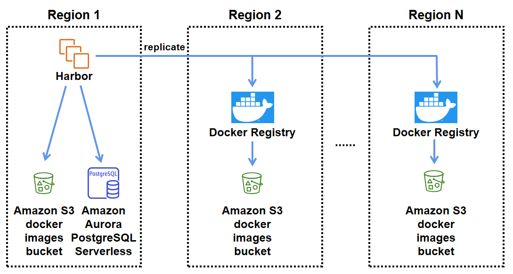
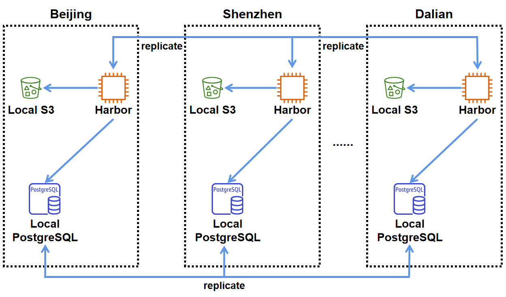
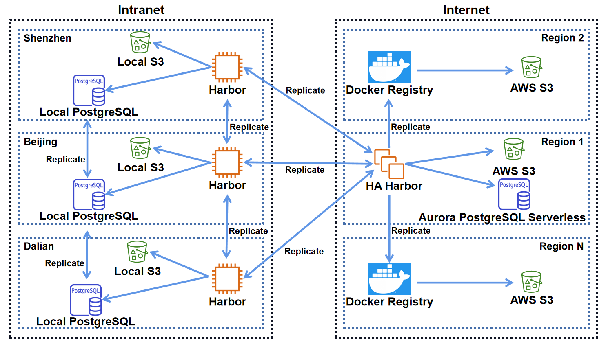
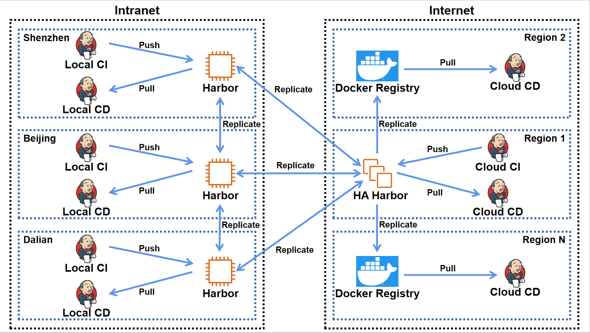

部署 Docker Registry 的方案
===========

*   [背景](#背景)
*   [需求](#需求)
*   [方案](#方案)

#   背景

为了更好的利用容器技术提供的便利，提高各类服务在开发、测试、生产环境下的部署效率，拟部署一套 Docker Registry 服务，用于公司内部各项目组使用。

#   需求

该系统有以下几点必须实现的基础需求：

*   应覆盖开发、测试、生产的所有区域。在云端，应覆盖有需要的所有区域（Region），在内网，应覆盖有需要的所有地区（分公司），以保证各个区域对该服务的访问速度。
*   映像应由持续集成系统生成，push 到系统内部的一个节点，通过一定的同步机制，将映像复制到各个区域的节点上，供持续交付系统进行部署使用。
*   部分节点应当对开发人员开放，对于公司内部 IP 开放 pull 功能，用于在开发环境下使用。
*   系统的核心应当基于官方的 Docker Registry，规避后续技术路线冲突带来的隐含风险。
*   映像存储应当使用云服务商的 S3 服务或者内网的 S3 服务。
*   开发者和本系统、持续集成/持续交付系统和本系统、本系统内部跨区域节点之间的通信数据都应当进行加密。

该系统最好可以支持以下的特性：

*   支持基于金山 SSO 的登录认证。
*   支持对映像的权限管理，使得映像在不同项目组之间隔离。
*   支持扩展，以适应后续可能存在的需求升级，包括但不限于映像签名，漏洞扫描等高级特性
*   支持密码的滚动更新，持续交付系统和本系统之间的密码应当定期更新
*   特定的几个可能会被大量开发者访问的节点，应当是高可用的

#   方案

##  工具

### Docker Registry

Docker Registry 是 Docker 官方发布的开源映像存储工具，是一个无状态、可扩展的映像存储服务。支持多种映像存储方式

延伸阅读：[Docker Registry Overview](https://docs.docker.com/registry/)

### Harbor

Harbor 是 VMware 公司开源的企业级 Docker Registry 项目，其目标是帮助用户迅速搭建一个企业级的 Docker 映像管理服务。

Harbor 以 Docker 公司开源的 Docker Registry 为基础，与其他众多开源的 Docker Registry 项目相比，Harbor 最大的特点就是企业级。他提供基于项目和角色的映像权限控制，支持通过机器人账号和 CI/CD 系统集成，可以在多个 registry 节点之间进行映像复制，是一个非常适合企业级开发者的开源映像管理工具。

Harbor 不仅提供了上文提到的几种核心特性，还支持 AD/LDAP 集成，审计日志 (Auditlogging) ，基于 clair 的映像漏洞扫描和基于 notary 的镜像认证等高级特性。

延伸阅读：[CNCF 宣布首个中国原创项目 Harbor 毕业](https://www.oschina.net/news/116677/harbor-graduate-from-cncf)

延伸阅读：[Harbor 官网](https://goharbor.io/)

## 高可用 Harbor 节点的构想

通过 Nginx 负载均衡连接到多个 Harbor 节点上，若干个 Harbor 节点依赖同一个 Redis，同一个 Aurora PostgreSQL Serverless 服务，同一个 S3 服务。

##  云端跨区域方案

为了实现云端多区域的覆盖，在一个 Region 中部署一个高可用 Harbor 节点，依赖该区域的 Amazon Aurora PostgreSQL Serverless 服务来存储账户信息。

所有需要在云端存储的映像都会被先 push 到 Region 1 的高可用 Harbor 节点上，然后 Harbor 会将映像复制到其他 Region 的 Docker Registry 上。

无论是 Harbor 还是 Docker Registry 的映像存储都依赖 AWS 的 S3 服务。

Docker Registry 是否要采用高可用形式部署，有待后续调研。

##  本地跨区域方案

为了实现本地的多区域覆盖，在每一个地区都部署一个 Harbor 节点，依赖该区域的 S3 服务做映像存储。

如果项目有本地跨区域同步的需要，可以在 Harbor 中进行配置，但不是所有的映像都需要在每一个本地节点保存一份。

账户信息等依赖本地的 PostgreSQL 服务，尚未确定是否需要部署跨区域的 PostgreSQL 集群， 有待后续调研。

##  内外网数据流向

本地的 Harbor 节点负责将映像同步到有需要的其他本地 Harbor 节点上，也负责将需要进行云端部署的映像同步到云端的高可用 Harbor 节点上。

云端的高可用 Harbor 节点只存在于一个区域，该节点负责将映像同步到其他区域的 Docker Registry 节点上。

云端的账户信息存储依赖 Aurora PostgreSQL Serverless 服务，本地的账户信息存储依赖本地 PostgreSQL 节点。

所有节点的映像存储都依赖自己所属区域的 S3 服务。

高可用 Harbor 节点只对公司 IP 通过白名单开放访问权限。

##  如何与持续集成、持续交付系统集成

所有的映像都应由持续集成（Continuous Integration）系统构建，然后通过独立的机器人账号同步到 CI 系统所属区域的 Harbor 节点。本地的 CI 系统 push 到本地的 Harbor 节点，云端的 CI 系统 push 到 Region 1 的高可用 Harbor 节点。

持续交付（Continuous Delivery）系统，通过另一个独立的机器人账号，从就近的 Registry 节点 pull 映像用于部署。本地的 CD 系统从本地的 Harbor 节点拉取映像，Region 1 的 CD 系统从高可用 Harbor 节点拉取映像，其他 Region 的 CD 系统从所属区域的 Docker Registry 拉取映像。

每个项目的管理员需要为项目创建专属的仓库，机器人账号，供开发人员使用的访客账号，开发人员有且只有 pull 权限。

# 待论证的问题

*   无法支持金山 SSO，虽然通过项目专属的访客账号隔离了 push 的权限，但没法对应员工离职转组等问题，后续考虑用 Vault 实现密码的滚动更新
*   如何及时有效地监控跨区域的多个 Harbor 和 Docker Registry 及其依赖的服务的状态，有待论证
*   内网和云端的 PostgreSQL 服务是割裂的，是否应当使用一致的数据，有待论证
*   Harbor 高可用节点中是否使用自建的高可用 Redis 集群，有待论证
*   内网是否应该部署一套跨区域的高可用 PostgreSQL 集群，有待论证
*   如何将基于 notary 的映像签名服务加入 harbor 集群中，有待探索
*   如何将基于 clair 的映像漏洞扫描服务加入 harbor 集群中，有待探索
