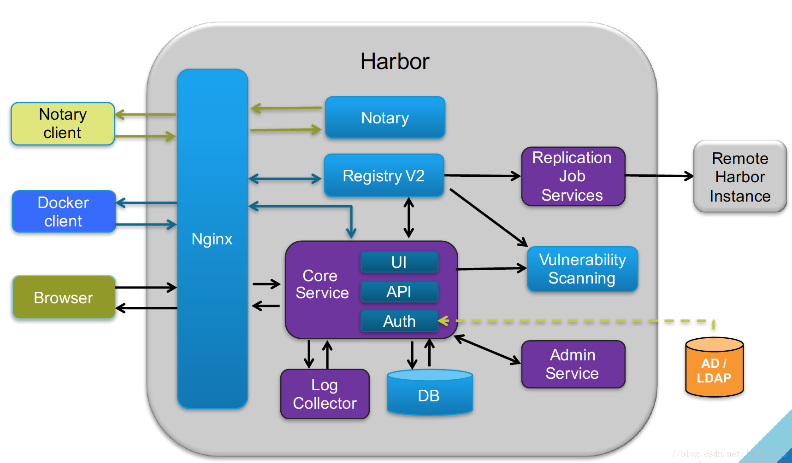

Harbor 简介
===========

*   [概述](#概述)
*   [基础架构](#基础架构)

#   概述

Harbor 是 VMware 公司开源的企业级 Docker Registry 项目，其目标是帮助用户迅速搭建一个企业级的 Docker 映像管理服务。

Harbor 以 Docker 公司开源的 Docker Registry 为基础，与其他众多开源的 Docker Registry 项目相比，Harbor 最大的特点就是企业级。他提供基于项目和角色的映像权限控制，支持通过机器人账号和 CI/CD 系统集成，可以在多个 registry 节点之间进行映像复制，是一个非常适合企业级开发者的开源映像管理工具。

Harbor 不仅提供了上文提到的几种核心特性，还支持 AD/LDAP 集成，审计日志 (Auditlogging) ，基于 clair 的映像漏洞扫描和基于 notary 的镜像认证等高级特性。

延伸阅读：[CNCF 宣布首个中国原创项目 Harbor 毕业](https://www.oschina.net/news/116677/harbor-graduate-from-cncf)

延伸阅读：[Intro: Harbor - Henry Zhang & Steven Ren, VMware](https://www.youtube.com/watch?v=REgvBPH369M)

延伸阅读：[Harbor 官网](https://goharbor.io/)

延伸阅读：[Harbor in Github](https://github.com/goharbor/harbor)

# 基础架构

如图，harbor 基于 Docker Registry v2，通过 Core Service 提供基本的

作者：搜云库技术团队
链接：https://segmentfault.com/a/1190000012745252
来源：SegmentFault 思否
著作权归作者所有。商业转载请联系作者获得授权，非商业转载请注明出处。

