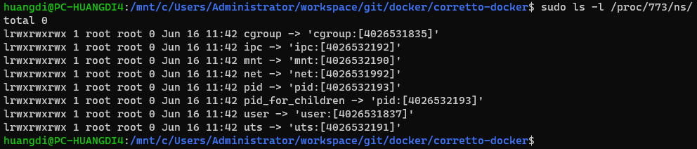

Docker 简介
===========

*   [概述](#概述)
*   [基本概念](#基本概念)
*   [安装](#安装)
*   [基础操作](#基础操作)
*   [最佳实践](#最佳实践)
*   [延伸阅读](#延伸阅读)

# 概述

##  Docker

Docker 是一个基于 go 语言开发的开源容器引擎，提供了一整套将应用容器化的工具和方法论。容器化的应用可以在一个虚拟的沙箱环境中运行，与其他的应用相互隔离，互不影响。

##  容器技术（Linux Container 或 LXC）

容器技术是一套轻量级的虚拟化技术，基于 Linux 内核实现。简略地说，一个容器就是一个或一组进程，通过内核提供的机制，与其他进程隔离起来。

所谓轻量级，是指与一些传统的虚拟化技术（比如虚拟机）相比，容器技术的隔离是进程级别的，而虚拟机是OS级别的隔离。


如图，容器技术和传统的虚拟机相比，不需要设备和OS之间的中间层 Hypervisor，每个容器都和宿主机共享同一个内核。所以容器技术比虚拟机消耗了更少的性能，占用了更小的空间，复杂度也更低。

容器技术并不是 Docker 发明的，Docker 底层使用了容器技术，在此基础上提供了很多其他的强大功能，也提高了易用性。

##  使用 Docker 的理由

*   在所有的场景，以同样的环境运行同一个应用。
*   简化部署流程。
*   更方便的历史版本管理。
*   同一个机器上的应用不会互相影响。

# 基本概念

##  映像（Docker Image）

映像是通过 Docker 对应用进行封装后生成的文件，映像中包含了运行应用程序所需要的所有内容，包括并不限于运行应用需要的操作系统、代码或者可执行文件、应用依赖的库、配置文件以及一些对映像进行说明的信息。

因为映像中包含了运行所需要的操作系统和其他运行环境，Docker 可以保证使用映像启动的应用，在任何一台机器上都以相同的环境来运行。同样，因为映像中包含了环境，使得部署的流程中搭建运行环境的步骤得以简化。

Docker 支持通过 Tag 机制对映像进行标记。在不同版本的映像中通过 Tag 标记不同的版本号，就可以比较方便的管理历史版本的应用。在需要启动某一个历史版本的应用时，直接通过 Tag 找到对应版本的映像即可直接启动。

##  Dockerfile

Dockerfile 是描述映像生成流程的文件，是映像的开发者和 Docker、映像的开发者和使用者之间沟通的一个接口。

开发者执行指令 docker build 之后，Docker 读取 Dockerfile 并按照开发者写好的流程来执行映像的生成，映像的使用者通过阅读 Dockerfile 来理解开发者制作映像的意图。

关于书写和管理 Dockerfile 的相关建议，详见最佳实践的[相关部分](#正确地书写Dockerfile)。

##  层（Layers）

每一个映像都由若干个层组成，每一层都代表了 Dockerfile 中的一个指令。比如这样的一个例子 Dockerfile：

```Dockerfile
FROM ubuntu:18.04
COPY . /app
RUN make /app
CMD python /app/app.py
```

会产生如下一个分成4层的映像：


四层分别代表了 Dockerfile 中的四个指令，并在最上面有一个可读写的层用来处理应用产生的数据。

分层结构是 Docker 提供的一个很强大的特性，每一层都有自己的特征码，通过在不同的映像间共享同样的层，可以起到压缩映像所占的空间的作用，也可以达到某种程度的增量更新的效果。合理的组织映像的分层结构是 Docker 很重要的一种最佳实践。

延伸阅读：[Images and layers](https://docs.docker.com/storage/storagedriver/)

##  容器（Container）

容器（Container）是 Docker 通过映像（Docker Image）执行的一个实例，同一个映像可以启动多个实例。容器的运行状态，可以通过指令 docker ps 查看，在 Windows 和 MacOS 平台上，也可以通过对应平台的 Docker Desktop 客户端来查看。

##  宿主机（Docker Host） 

宿主机是容器所在的机器，每一个容器都可以简略地看作是宿主机的一个沙箱化的进程。每个宿主机上都运行着一个 Docker 的服务 Docker daemon。

##  Docker 服务（Docker daemon）

每一台宿主机上都运行着一个 Docker 服务，负责管理映像、容器、容器网络和数据挂载，Docker 服务通过暴露 REST API 来和 Docker Cli 或其他客户端沟通。如下图：


##  Docker 映像存储库（Docker Registry）

Docker Registry 是一个无状态、高可用的开源映像存储服务器。可以用于建立私人映像存储库。Docker 官方宣称 DockerHub 就是 Docker Registry 的一个实例。

##  DockerHub

DockerHub 是 Docker 官方维护的一个公共的映像托管存储平台。可以在 DockerHub 上面找到很多开源项目的官方映像，合理地使用这些 DockerHub 上面的官方映像，而不是重复的自己制造同样的映像，也是 Docker 最佳实践的一种。

##  架构图


*   Client 并不一定要在宿主机上，Docker Daemon 支持通过网络远程访问。
*   Docker daemon 运行在宿主机上，接受客户端的指令，执行相关操作。
*   Registry 可以是 DockerHub 也可以是自建的映像存储库。
*   执行指令 docker pull 的时候，会从指定的远程 Docker Registry 拉取映像到本地缓存。
*   执行指令 docker build 的时候，会在本地生成映像，并放入本地缓存中。
*   执行指令 docker run 的时候，会先在本地缓存中查找映像，如果本地没有则会去远程存储拉取。

# 安装

为了更好的使用体验，windows 10 用户请将 windows 更新至 2004 版本，无法通过 window 更新自动升级到该版本的用户可以从[微软官方网站](https://www.microsoft.com/zh-hk/software-download/windows10)下载 windows 更新程序手动升级。

windows 10 更新完成后升级到 WSL2 的具体操作请参考官方指引 [Windows Subsystem for Linux Installation Guide for Windows 10](https://docs.microsoft.com/en-us/windows/wsl/install-win10)。

Docker 的安装请参照官方的指引 [Install Docker Engine](https://docs.docker.com/engine/install/)。

# 基础操作

首先推荐 Peter McKee 在 DockerCon 上的基础操作演示视频 [How to get start with docker](https://www.youtube.com/watch?v=iqqDU2crIEQ&feature=youtu.be)，口音很友好，全长28:51。

*   构建映像 docker build，举例：使用 BuildKit 在当前目录读取 Dockerfile 构建映像，并打开全量日志 
```
DOCKER_BUILDKIT=1 docker build -t myapp:version --progress=plain .
```
*   拉取映像 docker pull，举例：从 DockerHub 拉取 Ubuntu 映像 
```
docker pull ubuntu:bionic-20200526
```
*   运行映像 docker run，举例：在后台运行 Ubuntu
```
docker run -d ubuntu:bionic-20200526
``` 
举例：运行 Ubuntu 镜像并进入容器内部执行 bash 来查看容器内部环境
```
docker run -it ubuntu:bionic-20200526 /bin/bash
```
*   查看当下运行的容器状态
```
docker ps
```
*   查看目前缓存的全部映像
```
docker images
```

# 最佳实践

##  映像越小越好

映像越小, 通过网络传输映像所占用的流量就越少, 传输/读取/拉起映像的速度也会更快。

*   使用更合适的上游映像，举例：当需要运行一个 java 应用的时候，直接使用官方的 jdk 映像。
*   将编译和运行在不同的容器中进行，举例：将编译环境放在一个容器里，编译成功后，将生成的可运行文件放在一个包含运行环境的容器内作为生产环境中使用的映像。
*   如果有多个映像有共同的部分，可以将有共性的部分制作成一个自定义的基础映像，这样就可以在一次加载之后进入缓存，提高存储效率和拉起速度。
*   保证发布的映像尽可能精简，比如个别情况需要 debug 信息，可以在发布的映像上面再添加一层debug信息，生成一个用于 debug 的映像版本。

##  为映像提供标注

*   当生成映像的时候，永远要使用tag来标记，注明版本，用途和其他对发布有用的信息。
*   不要依赖自动生成的 latest 标签，对于第三方映像，latest 标签会使你无法保持对特定版本的依赖，对于自己构建的映像，只标记 latest 标签无法对映像进行版本管理。
*   使用 Dockerfile 中的 EXPOSE 和 VOLUME 指令说明容器需要暴露的端口和挂载的路径。
*   使用 Dockerfile 中的 LABEL 指令，为映像添加其他的注释信息。延伸阅读：[Docker object labels](https://docs.docker.com/config/labels-custom-metadata/)。
*   Tag，Dockerfile 和 LABEL 是通过非说明性文档对映像进行说明的三种方式，善用这三种方式将极大地提高映像对于使用者的可读性。

##  合理地处理应用的数据

容器的 writable layer 可以存储应用生成的数据，但这并不是推荐的做法，至少有以下几个缺点：

*   当容器被卸载，这些数据就丢失了。
*   这会增加容器的体积，降低拉起的速度。
*   writable layer 使用的 storage driver 的 I/O 表现也不如 volumes 或者 bind mounts。

Docker 提供了三种方式来将数据从Docker宿主机挂载（mount）到容器：

*   Volumes由Docker管理，存储在宿主机的某个地方（在linux上是/var/lib/docker/volumes/）。非Docker应用程序不能改动这一位置的数据。Volumes是Docker最好的数据持久化方法。
*   Bind mounts的数据可以存放在宿主机的任何地方，数据甚至可以是重要的系统文件或目录。非Docker应用程序可以改变这些数据。
*   tmpfs mounts的数据只存储在宿主机的内存中，不会写入到宿主机的文件系统。


volumes 模式适合以下场景：

*   应用的数据需要存储在一个远程的 host 机器或者云端，而不是在本地。
*   一份数据需要在多个容器间共享，且不会经常地改动。
*   一份数据需要备份，或者在多个 host 机器之间迁移。

bind mounts 模式适合以下场景：

*   将宿主机上面的配置文件共享给容器。
*   将宿主机上的代码和编译结果文件共享给容器，比如开发的过程中将代码共享给容器。
*   应用的数据只需要存在本地的宿主机上，比如本地测试服务器。

当数据不需要持久化保存的时候可以使用 tmpfs 模式。

##  正确地书写Dockerfile

*   由于映像构建上下文（Docker build context）的影响，使用相对路径指定 Dockerfile 和资源文件可能会导致向 docker ddaemon 传输无用的数据，拖慢构建速度。
*   如果映像的构建需要依赖本地的数据和文件，Dockerfile 应当保存在一个仅包含需要的依赖的文件的路径下。
*   如果映像构建不需要任何本地数据，Dockerfile 应当单独保存在一个路径下。
*   Dockerfile 的命名就是 Dockerfile。通常没有后缀，并以大写字母 D 开头，其他字母都是小写。比如 amazon corretto 是这样安排路径的：
```
└── corretto-docker
    ├── 11
        ├── jdk
        │   ├── al2
        │   │   └── Dockerfile
        │   ├── alpine
        │   │   └── Dockerfile
        │   └── debian
        │       └── Dockerfile
        └── jre
            └── alpine
                └── Dockerfile
```
*   使用 .dockerignore 文件来过滤掉不需要传输给 docker daemon 的文件。书写规则：[.dockerignore file](https://docs.docker.com/engine/reference/builder/#dockerignore-file)
*   使用多阶段的映像构建，延伸阅读：[Use multi-stage builds](https://docs.docker.com/develop/develop-images/multistage-build/)
*   不要安装应用不需要的包，一个映像应该仅仅包含一个应用运行需要的包。
*   尽量保证每个映像都只有一个应用，提供一个单一的服务。
*   尽量减少映像的层数，只有当执行 RUN，COPY，ADD 的时候才会生成一个新的层，应当尽量谨慎地使用这三个指令。
*   将多行的参数写得尽量可读，尤其是 RUN 的参数，每一行应该以空格和 backslash( \ )结尾，每一行只做一件事，如果安装多个包，每一行只应该有一个包。这可以降低维护成本，提高 review 的效率。举例：
```
RUN apt-get update && apt-get install -y \
  bzr \
  cvs \
  git \
  mercurial \
  subversion
```
*   善用缓存机制，每当执行 ADD 和 COPY 命令，docker 都会对被复制的文件取特征码，如果在缓存中发现了完全一样的层，就可以提高构建的速度。


# 延伸阅读

##  容器网络（Network）

容器网络是 Docker 提供的特性，可以将多个隔离开的容器之间，通过若干种不同的模式连接起来，实现网路的共享和互通。

### host networks

*   host mode 是 docker 中最直接和符合直觉的用法，host 模式下容器和宿主机共享一个网络，不需要控制端口暴露和相互隔离，启动参数中的 publish 和 port 也会被自动忽略。
*   host mode 目前只能在 Linux 系统中使用，官方的说法是：
> The host networking driver only works on Linux hosts, and is not supported on Docker Desktop for Mac, Docker Desktop for Windows, or Docker EE for Windows Server.
*   延伸阅读：[Use host networking](https://docs.docker.com/network/host/)

### bridge networks

*   bridge mode 是 docker 默认的容器网络模式，默认状态下容器内的网络和宿主机隔离，互相无法访问，可以选择暴露端口给宿主机。使用默认模式的容器都会连在一个默认的 default 网络中。
*   bridge mode 允许用户自己声明一个 docker network，并将容器连接到这个网络中，同一个 network 中的容器可以通过域名互相访问，并在网络内部提供一个域名 host.docker.internal 来访问宿主机。
*   使用 bridge mode 可以通过自定义 network 精确控制容器之间的访问权限，比如一个 web 应用的前端和后端都连一个 network A 上，而后端和数据库都连在另一个 network B 上，就实现了相互的隔离。
*   延伸阅读：[Use bridge networks](https://docs.docker.com/network/bridge/)

### overlay networks

*   overlay mode 用于在多个 docker daemon 之间创建一个分布式的网络，允许一个容器集群之间互相访问。
*   overlay mode 的创建和管理方式和 bridge mode 很像，但是为了管理 docker daemon 之间的网络，会有一个 docker_gwbridge 来连接 docker daemon。
*   延伸阅读：[Use overlay networks](https://docs.docker.com/network/overlay/)

### none networks

*   none mode 用于完全隔离容器的网络。

##  Linux namespaces

Linux namespaces 是容器技术依赖的内核特性之一。它决定了进程可以"看见"的资源，容器技术使用 namespaces 来将不同进程使用的资源隔离开，使容器化的进程在规定好的范围内运行，在某种程度上决定了容器"能不能"使用某种资源。比如：

*   使用非 root 用户创建一个容器，但使用 namespaces 成为容器内部的 root 用户。该用户在宿主机的系统中被看作是个普通用户，但是在容器内部被看作 root。
*   使用 namespaces 重新定义容器使用的文件系统，将宿主机系统中的一个子路径看作容器内部的根目录，类似 chroot 的作用。

namespaces 通过id互相区分，在 /proc/$pid/ns 下可以查看某个特定进程属于哪个 namespaces ：



具体的一种使用方法，是在调用 clone 的系统接口时，传入诸如 
```
flags = CLONE_NEWNS | CLONE_NEWUTS | CLONE_NEWIPC;
```
的 flag 来控制有哪些资源是新的 namespaces 独享的。

延伸阅读：[Linux namespaces in wikipedia](https://en.wikipedia.org/wiki/Linux_namespaces)

延伸阅读：[GOTO 2018 • Containers From Scratch • Liz Rice](https://youtu.be/8fi7uSYlOdc)（强烈推荐，不使用 docker 如何从零开始创建自己的容器）

##  Linux control groups

Linux control groups 同样是容器技术依赖的内核特性之一。它决定了进程可以“使用”的资源，容器技术使用 control groups 来控制进程对资源的使用，在某种程度上决定了容器能“用多少”资源。

比如, 可以使用 control groups 来限制容器能获取的内存数量，内部能运行的进程数量，控制一个周期内对CPU的使用时间，不同的容器对 CPU 资源使用的权重，或者在哪几个具体的 CPU 核心上运行容器内的进程。


如图，control groups 使用树形结构来控制进程的权限，可以将某个进程（task）或者一组进程（task group）挂载到代表具体某种资源控制的树（Hierarchy）中的某个节点上，来实现不同对不同进程的不同资源进行控制的目的。

可以在 /sys/fs/cgroup 下可以查看各个cgroup的配置，这个路径下的文件就是内核对 control groups 树形控制结构的一个映射。

延伸阅读：[cgroups in wikipedia](https://en.wikipedia.org/wiki/Cgroups)

延伸阅读：[Cgroups, namespaces, and beyond: what are containers made from?](https://youtu.be/sK5i-N34im8)